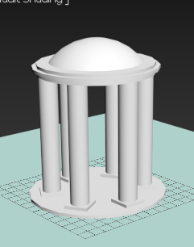
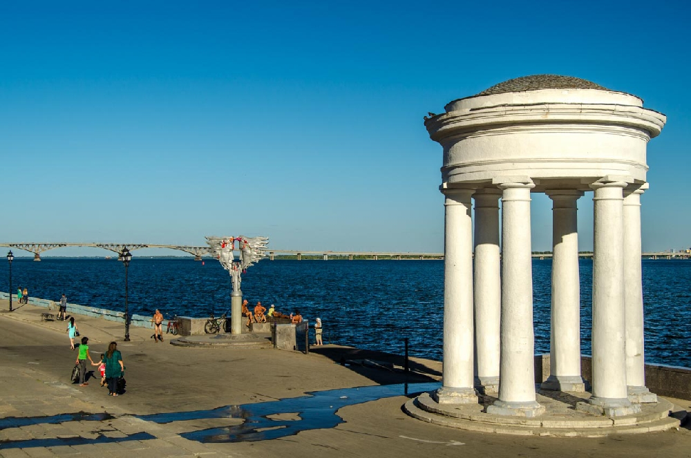

# 🏛 3D-моделирование (3ds Max)

## 📌 Описание
Лабораторная работа по 3D-моделированию в **3ds Max**.  
Была создана модель **Ротонды в Саратове**, изучены основы работы с геометрией, текстурами и освещением.

---

## 📂 Структура проекта

- `rotonda.max` — 3D-модель в 3ds Max  
- `Ротонда.png` — скриншот модели  
- `РотондаОригинал.jpg` — фото реального объекта  

---

## 📸 Результаты / Пример работы

**Модель в 3ds Max**  

**Оригинал (реальный объект)**  

---

## 🔎 Выводы
- Модель позволяет изучить геометрию и структуру архитектурного объекта.  
- Работа с текстурами и освещением развивает навыки визуализации.  
- Навыки пригодятся для более сложного 3D-моделирования и VR/AR проектов.

---

## 🛠 Используемые технологии
- Autodesk 3ds Max — моделирование и визуализация объектов
