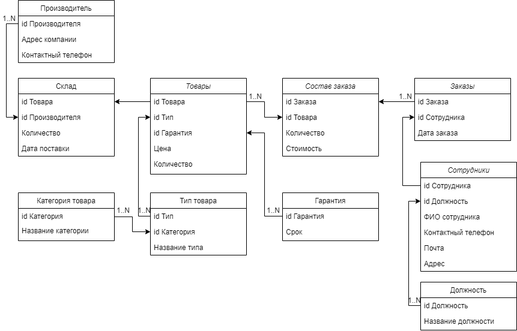
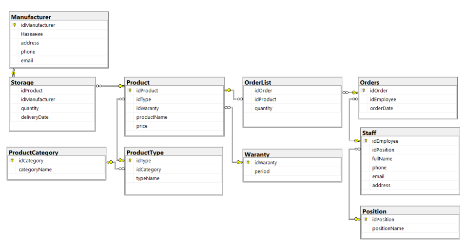

# 🖥 База данных магазина (Microsoft Access)

## 📌 Описание
Проект посвящён разработке базы данных для фирмы по продаже **компьютеров, оргтехники и комплектующих**.  
Цель — создать систему для хранения информации о товарах, клиентах, заказах и поставках, с возможностью выполнения запросов и процедур для анализа данных.

---

## 📂 Структура проекта

- [Доклад](Доклад.pdf) — текстовая работа с описанием проекта  
- `Запросы.sql` — SQL-запросы к базе данных  
- `Процедуры.sql` — хранимые процедуры  
- `Триггеры.sql` — триггеры базы данных  
- `Функции.sql` — пользовательские функции  
- `Eldorado.bak` — резервная копия базы данных

---

## 📊 Результаты / Примеры

**ER-диаграмма базы данных**  

**Диаграмма структуры базы данных**  

> Диаграммы показывают связи между таблицами и структуру хранения данных.

---

## 🔎 Выводы
- Разработана полная структура базы данных для магазина техники.  
- Реализованы запросы, процедуры, функции и триггеры для работы с данными.  
- База данных обеспечивает удобное хранение информации о товарах, клиентах, заказах и поставках.  
- Навыки работы с Access и SQL пригодятся для создания сложных информационных систем.

---

## 🛠 Используемые технологии
- Microsoft Access — создание и управление базой данных  
- SQL — запросы, функции, процедуры, триггеры
